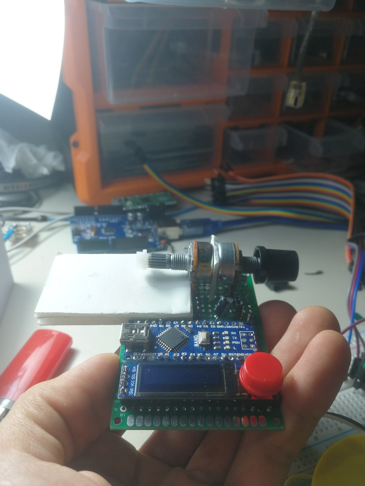

# Servo Tester V0

Main purpose of the servo is to turn to given angle. But unfortunately servos like SG90 and MG90 could`t do it properly. Due to that factory defect, it causes wrong computations. 

The idea is to give input througt first potentiometer and attach servo to second potentiometer then measure differences between them.

# Prerequire

## I used this parts:
- Arduino Nano 
- OLED 128x32
- Servo 
- 2X 10k Potetiometer
- Button  
- 220uf condensator 
- Prototype Board with 18x27 pins
 
# Hardware

//TODO Shematics

I measured potentiometer to achive getting input only when lever is parall to the board. Then I embed all other parts.

  

# Resulte

# Conclusion

The idea, measuring with potentiometer not work well. To place in correct position require playing with poteniometer which causes calsulation mistakes. Also, when voltage is not constant it begins to get crazy. But this device realy helped me with debugging my robot. 

