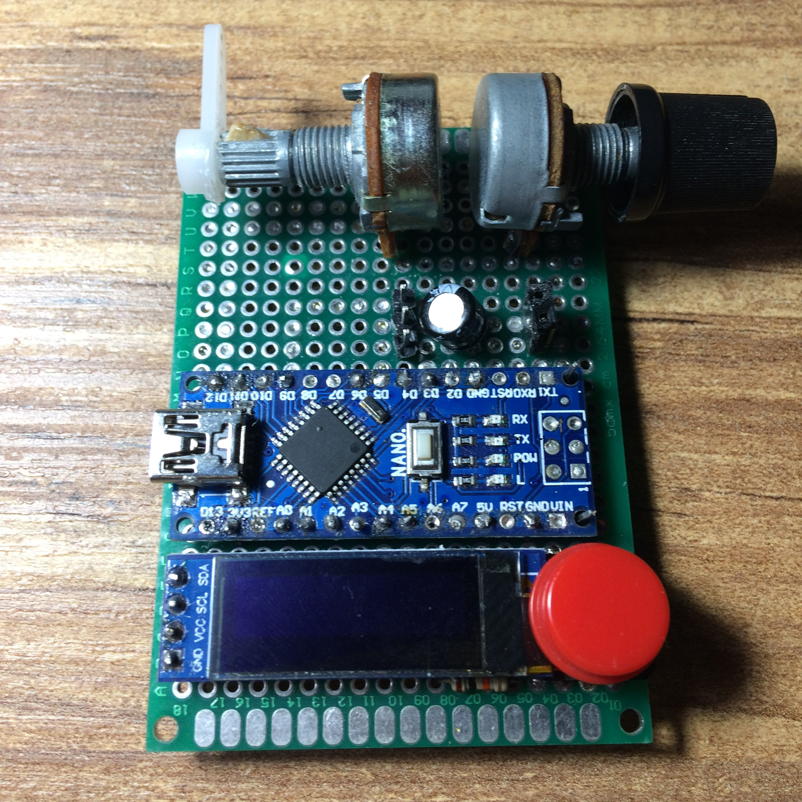
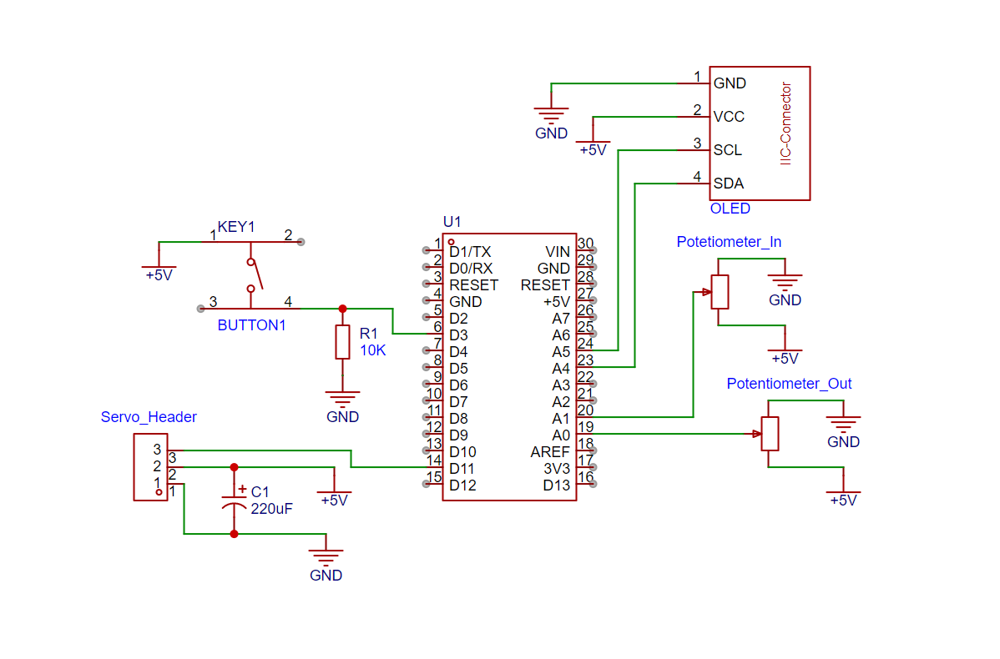

# Servo Tester V0

Main purpose of the servo is to turn to given angle. But unfortunately servos like SG90 and MG90 could`t do it properly. Due to that factory defect, it causes wrong computations. 

The idea is to give input througt first potentiometer and attach servo to second potentiometer then measure differences between them.

<a >
     
    
     
 </a>

|                          | On progress | Completed |
| ------------------------ | :---------: | :-------: |
| Stability                |   &cross;   |           |
| Platform for Servo       |   &cross;   |           |
| OLED Connection          |             |  &cross;  |
| Button Connection        |   &cross;   |           |
| Potentiometer Connection |             |  &cross;  |

 

# Components

## I used this parts:
- Arduino Nano 
- OLED 128x32
- 1x3P Header for Servo input
- Two 10k Potetiometer
- Button  
- 220uf condensator 
- Prototype Board with 18x27 pins
- Servo`s Attachment
 
# Embedding

When embedding, It require bit adjustments. 
  - Turn servo`s potentiometer in default position then by checking the potentiometer values throgh screen, begin to glue attachment. 

   

   - By adding little platform about 9 mm heigh is enough to position servo to attachment.

# Schematic

 

# Conclusion

The idea, of measuring with a potentiometer is a bit problematic. To place poteniometer in correct position require adjustment which can cause little deviation. Also, It work properly only on constant voltage. Even then, this device significiantly helped me to debug my robot. 

