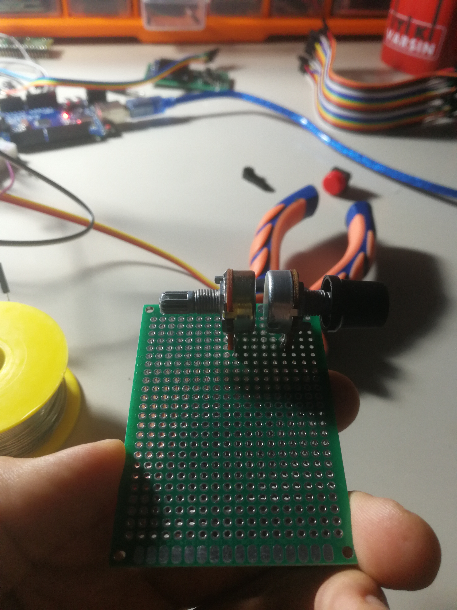
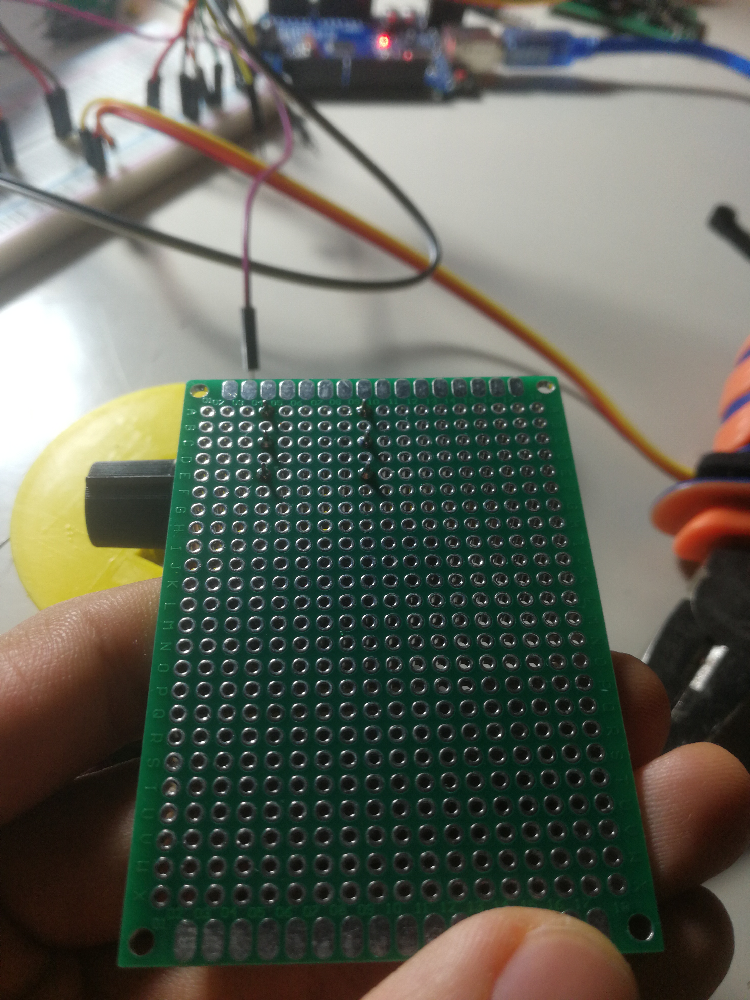
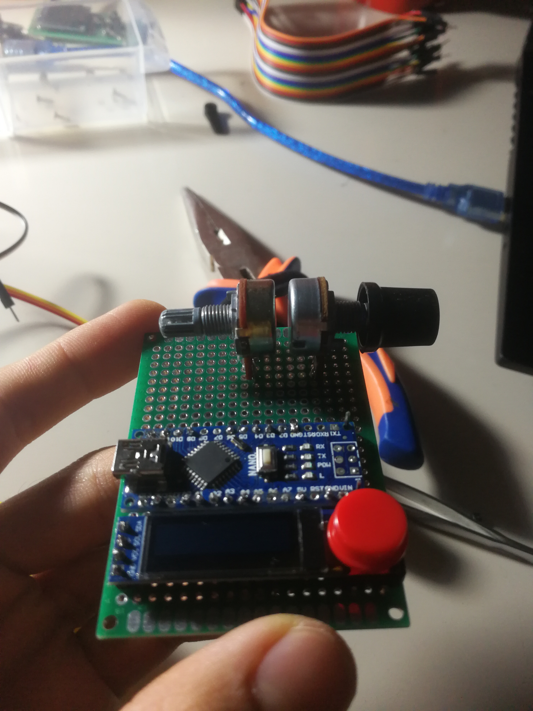
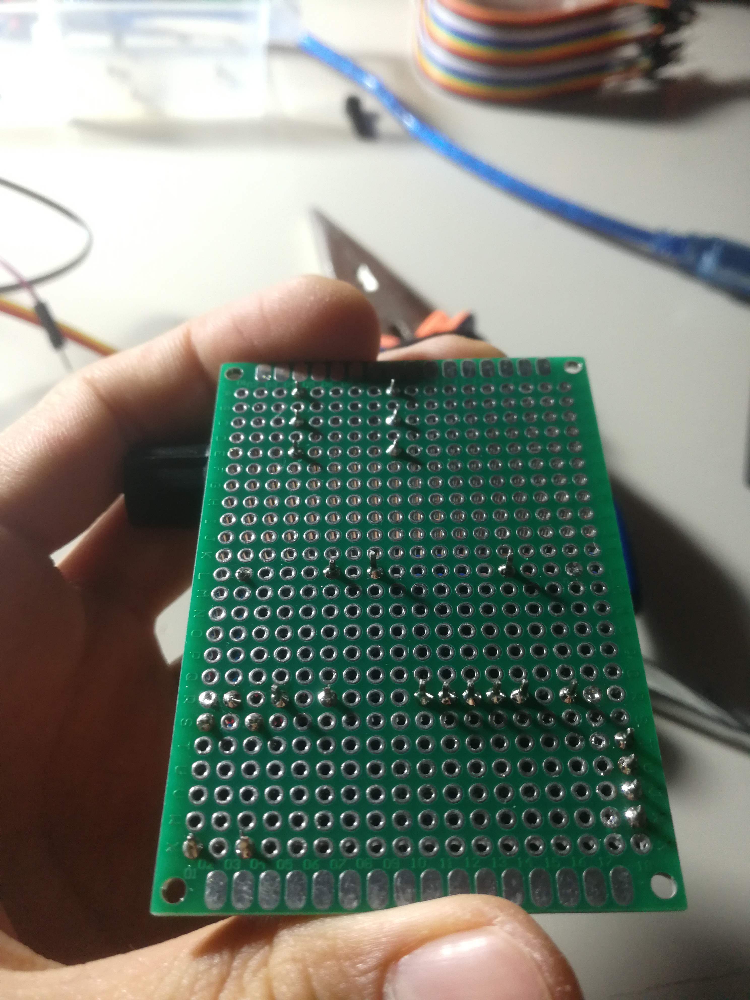
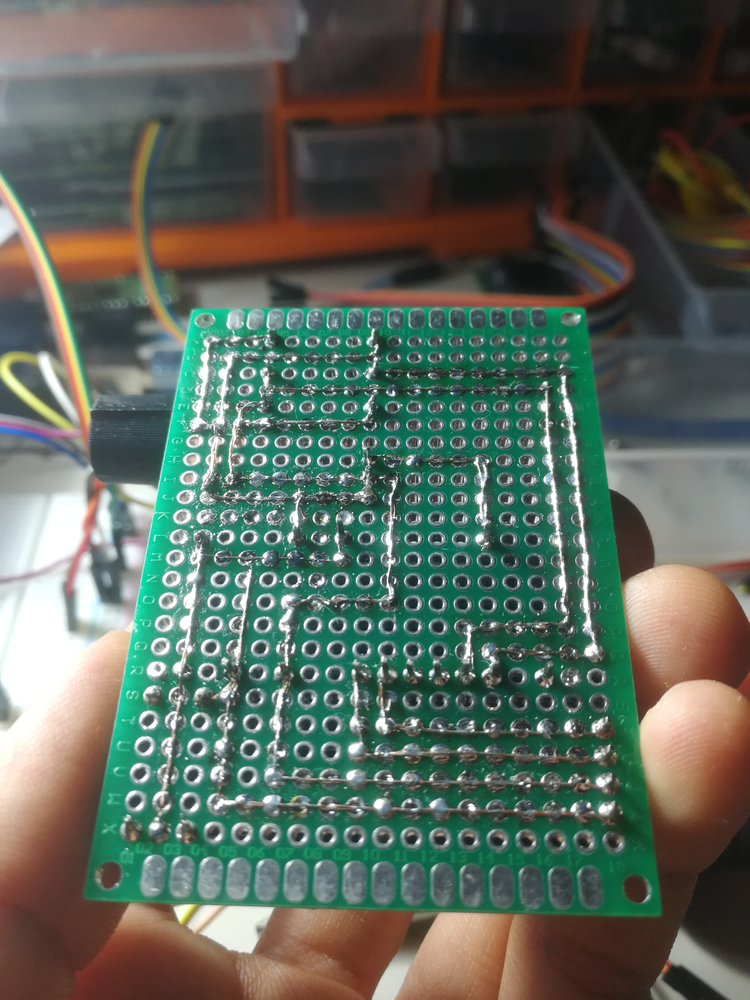

# Servo Tester V0
## About 
Many servos have factory defects where servo can`t make correct angles.
 
This problem can be fixed with the map() function. This function is used to change the range of potentiometer. But to find correct numbers of that ranges we need to measure reel angles from servo. For this i will use potentiometer.

When you are working on big projects where you use much more servos and also use precised movements it needs practical devices. Then I thought about making a Servo Tester that can quickly and precisely correct servo angles. I made it for my next Quadruped V2 in which I will be using 12 servos. 

Ingredients :
- Arduino Nano 
- OLED 128x32
- Servo 
- 2X 10k Potetiometer
- Button  
- 47uf condensator or more
- PCB Prototype Board
  
We need to find value a for the starting point on **first** potentiometer which measures the servo angle to make it more precise. We need to turn the potentiometer slightly to get a value that is close to the starting point. Otherwise it measures the unnecessary part. 

 ## I marked the starting point to help when i mount servo attacher...


Then we rotate that potentiometer by 180 deg then note the measured value. We can use this while converting potentiometer's value to degree.

This process is required only for the first time.

Then tinkering..
#
## Embedding all parts to board...






## I add 47uf condensator to compensate consumptions...

## Made little platform for servo...

#
# Software
At this part i used this Libraries:
```c
    #include <stdlib.h>            //For Pointers
    #include <Servo.h>             //Library for servos
    #include <Adafruit_GFX.h>      //These are for OLED screen
    #include <Adafruit_SSD1306.h>  //
    #include <stdarg.h>            //For Formatted String logs
```

Making a memory allocation and creating values in a pointer array.
```c
    int *data = (int*)malloc(4*sizeof(int));     
```
Value of the first potentiometer..
```c
    data[0]=analogRead(pot_pin1); //
```
Value of the second potentiometer..
```c
    data[1]=analogRead(pot_pin2); //Value of s
```
   Converting **measured** first potentiometer values to angles...
```c
    data[2]=map(analogRead(pot_pin1),0,669,0,180);
```
Converting  second potentiometer's value to angle...
```c
    data[3]=map(analogRead(pot_pin2),0,1023,270,0);
```
#
##  void seriallogDetails(int *data)
This function for printing logs for the Serial port.
```c
    serialPrintf("pot1: %4d\tpot2: %4d\tangle1: %3d\tangle2: %3d\n",data[0],data[1],data[2],data[3]);
```
Arduino can not print **Formatted string**.

To make it possible I added following function from this [site](https://medium.com/@kslooi/print-formatted-data-in-arduino-serial-aaea9ca840e3).
```C
    #include <stdarg.h>

    #define SERIAL_PRINTF_MAX_BUFF      256

    void serialPrintf(const char *fmt, ...);void serialPrintf(const char *fmt, ...) {
    /* Buffer for storing the formatted data */
    char buff[SERIAL_PRINTF_MAX_BUFF];  /* pointer to the variable arguments list */
    va_list pargs;  /* Initialise pargs to point to the first optional argument */
    va_start(pargs, fmt);  /* create the formatted data and store in buff */
    vsnprintf(buff, SERIAL_PRINTF_MAX_BUFF, fmt, pargs);
    va_end(pargs);  Serial.print(buff);
    }
```

## void oledLogDetailes(int *data )
This function for printing values to the OLED screen.
it needs do define this libraries. You can find that on Arduino Library Manager.
```c
    #include <Adafruit_GFX.h>
    #include <Adafruit_SSD1306.h>
```
Defining OLED size and reset pin
```C
    #define SCREEN_WIDTH 128 // OLED display width, in pixels
    #define SCREEN_HEIGHT 32 // OLED display height, in pixels

    #define OLED_RESET     4 
    Adafruit_SSD1306 display(SCREEN_WIDTH, SCREEN_HEIGHT, &Wire, OLED_RESET);
```
Enable it on setup
```c
    void setup(){
    display.begin(SSD1306_SWITCHCAPVCC, 0x3C);
    }
```
```c
    display.clearDisplay();
  display.setTextSize(1);                //Prepairing for printing
  display.setTextColor(SSD1306_WHITE);   //
  
  display.setCursor(0,0);
  display.print(F("Pot1:"));
  display.print(data[0]);
  
  display.setCursor(0,8);
  display.print(F("Pot2:"));
  display.print(data[1]);
  
  display.setCursor(0,16);
  display.print(F("Pot1 Ang:"));
  display.print(data[2]);
  
  display.setCursor(0,24);
  display.print(F("Pot2 Ang:"));
  display.print(data[3]);
  //2nd coulomb
  display.setCursor(75,16);
  display.print(F("Dif:"));
  display.print(data[3]-data[2]);         //difference between pot angles

  display.setCursor(75,24);             
  display.print(F("Per:"));
  display.print((5* (data[3]-data[2]))/9); //mistake persentage between angles
  display.print(F("%"));
  
  display.display();   //This needed to enable changes on screen


